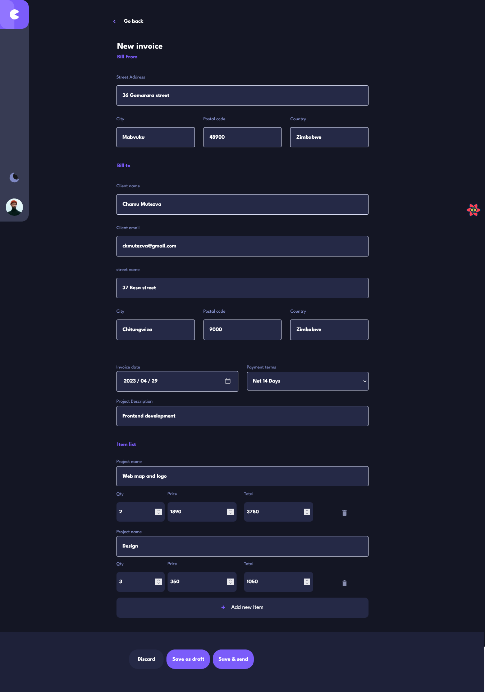

# Frontend Mentor - Invoice app solution

This is a solution to the [Invoice app challenge on Frontend Mentor](https://www.frontendmentor.io/challenges/invoice-app-i7KaLTQjl). Frontend Mentor challenges help you improve your coding skills by building realistic projects.

## Table of contents

- [Overview](#overview)
  - [The challenge](#the-challenge)
  - [Screenshot](#screenshot)
  - [Links](#links)
- [My process](#my-process)
  - [Built with](#built-with)
  - [What I learned](#what-i-learned)
  - [Continued development](#continued-development)
  - [Useful resources](#useful-resources)
- [Author](#author)
- [Acknowledgments](#acknowledgments)

## Overview

### The challenge

Users should be able to:

- View the optimal layout for the app depending on their device's screen size
- See hover states for all interactive elements on the page
- Create, read, update, and delete invoices
- Receive form validations when trying to create/edit an invoice
- Save draft invoices, and mark pending invoices as paid
- Filter invoices by status (draft/pending/paid)
- Toggle light and dark mode
- **Bonus**: full-stack app

### Screenshot




### Links

- Frontend Mentor Solution URL: [Frontend Mentor solution url](https://www.frontendmentor.io/solutions/invoice-app-tanstack-queryreact-query-react-hook-form-LLKN1HpWdS)
- Live Site URL: [Invoice app](https://invoice-app-ckm.netlify.app/)

## My process

I created the challenge as a Fullstack application, the backend files are in a separate folder known as `invoice backend`
The Backend fetches and stores data that is stored in MongoDb. Project created using Vite typescript.

### Built with

- Semantic HTML5 markup
- CSS custom properties
- Flexbox
- CSS Grid
- Mobile-first workflow
- [React](https://reactjs.org/) - JS library
- [React Query](https://react-query-v3.tanstack.com/) - Fetching data from the server
- [React Router](https://reactrouter.com/en/main/start/tutorial) - navigation
- [React hook form](https://react-hook-form.com/api/useform/register/) - forms and form validation

### What I learned

#### Using React Query now known as TanStack Query

- used for data management - data fetching , caching , sychronizing and updating the server state
- installation: install using npm by typing `npm i react-query` on the terminal or yarn `yarn add react-query`

##### Using React Query

1. in the root of the application , I have used the **App.tsx** as the center for data management. The following steps were taken
2. import { QueryClient, QueryClientProvider } from "react-query";
3. const queryClient = new QueryClient();

``` tsx
<QueryClientProvider client={queryClient}>
      <div className={`app ${theme ? "" : "dark-mode"}`}>
        <header className="flex header">
          <div className="flex controls">
            <div className="logo-container">
              <a className="btn btn-logo" href="">
                
                <span className="sr-only">preprince investments</span>
              </a>
            </div>

            <Toggle theme={theme} onChange={onChange} />
          </div>
          <div className="profile">
            <a href="#" className="btn btn-profile">
              
              <span className="sr-only">customer profile</span>
            </a>
          </div>
        </header>
        <RouterProvider router={router} />
      </div>
      <ReactQueryDevtools initialIsOpen={false} position="bottom-right" />
    </QueryClientProvider>
```

- 4. Then in the app, `useMutation, useQuery` mainly are used for data fetching, where `useQuery` is used to get data when
there is no need to update the data and `useMutation` is used for updating data

#### Creating a Clickable Card

- make the div `card` that should be clickable to be of `position: relative`
- then one child element of the `card` div should be an anchor element. In our example React router uses the `Link` as the
anchor element . See code below

```html
<div key={invoice.id} className="card">
    <p>{invoice.id}</p>
    <p>{invoice.clientName}</p>
    <p>{invoice.paymentDue}</p>
    <p>R: {invoice.total}</p>
    <Link className="btn-link" to={"/viewInvoice"}>{invoice.status}</Link>
 </div>
```

```css
.card {
  position: relative;
  background: red;
}

.btn-link {
  display: block;
  &::before {
    position: absolute;
    content: "";
    width: 100%;
    height: 100%;
    top: 0;
    left: 0;
  }
}
```

#### Error - Unexpected application error

##### Rendered more hooks than during the previous render


The application has multiple pages and the error is encountered during navigation. Here is a brief steps that I
performed to notice the bug.

1. From  the homepage , I navigated to the `ViewInvoice` page
2. In the `ViewPage` , reload the page.

##### Causes and solution

The error is caused by (in this particular case) , having a hook which was called after a condition


Moving the useMutation hook above the if condition will solve the error


### Reusable overlay

Link to 
Application link 

```tsx
<OverLay
     isOverlayOpen={isNewInvoiceOverlayOpen}
     toggleOverlay={toggleOverlay}
    >
     <NewInvoice
      toggleOverlay={toggleOverlay}
      childInputRef={childInputRef}
     />
    </OverLay>
```

### Continued development

- Focus control when new pages has been opened
- Focus trapping

### Useful resources

- [A Complete Guide to Mutations in React Query - Part 5 - Using the useMutation Hook to Delete Resources on the Server.](https://hemanta.io/a-complete-guide-to-mutations-in-react-query-part-5-using-the-usemutation-hook-to-delete-resources-on-the-server/)
- [REST APIs - How To Mutate Data From Your React App Like The Pros](https://profy.dev/article/react-query-usemutation)
- [UseForm hook - watch](https://react-hook-form.com/api/useform/watch/)
- [Reusable hook forms text input](https://blog.qoddi.com/create-a-reusable-text-input-with-react-hook-form/)
- [datefns](https://date-fns.org/v2.29.3/docs/format)

## Author

- Website - [Chamu Mutezva](https://github.com/ChamuMutezva)
- Frontend Mentor - [@ChamuMutezva](https://www.frontendmentor.io/profile/ChamuMutezva)
- Twitter - [@ChamuMutezva](https://twitter.com/ChamuMutezva)

## Acknowledgments
